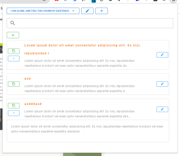

# Text Slinger


Saving frequently used text fragments for future reuse.

## Features

- **Save Frequently Used Text:** Easily save and categorize commonly used text fragments.
- **Quick Access:** Retrieve your saved texts through a simple, searchable interface.
- **Streamlined Workflow:** Save time on repetitive typing in forms, searches, and more.

For a deeper dive into the concept and motivations behind Text Slinger, refer to our [Extended Idea Documentation](docs/idea_extended.md).



Loading the Extension into Chrome
---------------------------------

To add Text Slinger as an unpacked extension in Chrome:

1.  Open Chrome and navigate to `chrome://extensions/`.
2.  Enable Developer Mode by toggling the switch in the upper-right corner.
3.  Click on "Load unpacked" and select the `dist/bex` folder from your Text Slinger build directory.
4.  The extension should now be added to your Chrome and ready to use.

Development
---------------------------------

## Install the dependencies
```bash
npm install
```

### Start the app in development mode (hot-code reloading, error reporting, etc.)
```bash
npm run dev
# or
quasar dev -m bex
```


### Lint the files
```bash
yarn lint
# or
npm run lint
```

### Build the app for production
```bash
npm run build
# or
quasar build -m bex
```

Text Slinger
Text saving browser extension.

## Idea

### Short description:

Saving frequently used text fragments for future reuse.

### Description:

While browsing internet often needed to input same text over and over. Like search clauses, inputs, form fills, comments and messages. Sometimes solved by resorting to create text files with reused text, this could be inconvenient.
This extension is aim to solve this problem by providing user friendly system for managing reusable texts directly in browser.


TODO:
- optimize code across
- go through TODOs
- add text with no category (in context menu)
- show text item category in list

IN FUTURE VERSIONS
- import / export
- texts sequence with drag and drop reorder
